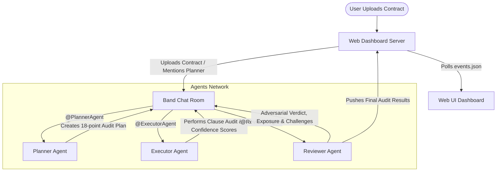

# ⚖️ LexAudit: Multi-Agent Compliance Audit System

LexAudit is a multi-agent system designed for automated, high-fidelity contract compliance auditing. Built on the **Band** multi-agent coordination platform, it coordinates three specialized agents (Planner, Executor, and Reviewer) to parse contracts, construct compliance checklists, execute detailed clause analysis, and perform adversarial review.

A beautiful, interactive web dashboard provides real-time visualization of the agent communication, dynamic audit logs, contract visual highlighting, and historical audits.

---

## 🌟 Unique Features

LexAudit goes beyond standard LLM contract analysis by implementing:

### 🗡️ Devil's Advocate Mode
Instead of blindly agreeing with the audit findings, the **Reviewer** agent critiques findings from the opposing party's perspective. It highlights potential legal loopholes, challenges severity levels, and presents contrarian arguments. In the UI, challenged items are marked with an orange border and a swords icon (⚔️).

### 📊 Confidence Heatmap
Both the **Executor** (analyzing compliance checkpoints) and the **Reviewer** (critiquing findings) assign confidence scores (0–100%) to their output. The UI maps these to a color-coded bar (Green for High, Amber for Medium, Red for Low) to immediately highlight where human oversight is most needed.

### 💰 Dollar Exposure Estimation
For every High or Critical risk finding, the agents estimate the potential financial impact (dollar exposure) of the non-compliance. These per-finding ranges are aggregated into a total risk banner at the top of the dashboard.

---

## 🏗️ Multi-Agent Architecture



1. **Planner Agent:** Creates an audit blueprint (18 core compliance checkpoints) based on the contract type and context.
2. **Executor Agent:** Iterates through every checkpoint, matches them against the contract text, generates findings, and assigns confidence scores.
3. **Reviewer Agent:** Performs adversarial critique (Devil's Advocate), estimates dollar exposure, and assigns the final compliance verdict.

---

## 🛠️ Installation & Setup

### Prerequisites
- Python 3.10+
- Node.js (for browsing locally)
- A registered account on [app.band.ai](https://app.band.ai) and [Featherless.ai](https://featherless.ai)

### 1. Clone & Install Dependencies
```bash
git clone https://github.com/DeathKnell837/band-of-agents-hackathon.git
cd band-of-agents-hackathon

# Initialize virtual environment
python -m venv .venv
.venv\Scripts\activate

# Install Python requirements
pip install -r requirements.txt
```

### 2. Configure Environment Variables
Create a `.env` file in the root directory:
```env
THENVOI_REST_URL=https://app.band.ai
THENVOI_WS_URL=wss://app.band.ai/ws
FEATHERLESS_API_KEY=your_featherless_api_key
```

Configure `agent_config.yaml` with your Band agent credentials (Planner, Executor, Reviewer UUIDs and API keys):
```yaml
agents:
  planner_agent:
    id: "your-planner-agent-uuid"
    key: "your-planner-agent-api-key"
    handle: "@PlannerAgent"
  executor_agent:
    id: "your-executor-agent-uuid"
    key: "your-executor-agent-api-key"
    handle: "@ExecutorAgent"
  reviewer_agent:
    id: "your-reviewer-agent-uuid"
    key: "your-reviewer-agent-api-key"
    handle: "@ReviewerAgent"
```

---

## 🚀 How to Run

To run LexAudit locally:

### 1. Start the Web Server
Starts the frontend dashboard server on port 3000 (with CORS-enabled REST API proxy):
```bash
python scripts/server.py
```

### 2. Start the Agent Listener Network
Launches all 3 agents in parallel, establishing WebSocket connections to the Band platform to process incoming audits:
```bash
python scripts/run_all.py
```

### 3. Open the Dashboard
Open your browser and navigate to:
```
http://localhost:3000
```
Upload a document (e.g., `sample_contract.txt`), click **Start Audit**, and watch the agents collaborate in real-time!
